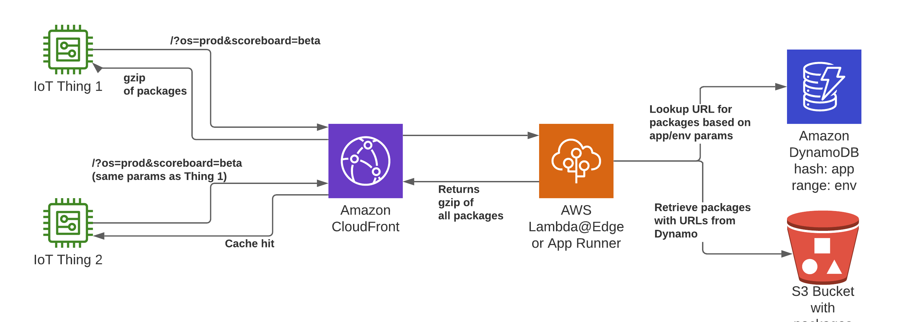

# CloudFront Dynamic Package Distribution for IoT Workloads

## Background

A common pattern for IoT devices is for updates to pushed over the air to the devices. However, in some cases, it may not be possible to control updates to a device, in the case of "anonymous" devices that are unregistered with a backend system. In some cases it may also be cost prohibitive to try to manage updates to large fleets of devices, where a fire-and-forget strategy might be better suited.

For larger devices running a full operating system, updates are generally accomplished through a package manager (apt, yum, etc). However this power/performance prohibitive on smaller devices. Even for devices running a full operating system, it can be benficial to control the updates from the server side and remove any client side logic.

## Overview

### Use Case

This solution provides a sample of using a CloudFront distribution (CDN) backed by Lambda or AppRunner and Dynamo to dynamically generate packages for devices and provide a simple solution for distributing them at scale.


### Flow Summary

A client will call the CloudFront endpoint with a set of query parameters defining attributes related to the device (rather than package names, for example). The application layer will then use these query params to determine which binaries should be delivered to the device. Optionally, the client can include an MD5 hash of any currently installed binaries. These are inserted in the "If-None-Match" header and are called "Etags". Any binaries that would've been returned from the application that match the MD5 hash of one of these Etags will not be included in the return package. If the device already has all the binaries required (as indicated by all binaries matching one of the Etags), the application will return a 304 Not Modified.

Note: If the application is deployed in Lambda instead of in AppRunner, it will only be able to return a metadata file with individual update URLs and the client will have to download those separately. This is due to a max return size of 1MB from Lambda.

CloudFront will then cache the response and return it to the client.
The detailed request/response sequence can be seen below.

### Architecture Overview

Below is a sequence diagram and overview diagram for this demo.




### AWS Services Used
- Amazon CloudFront
- AWS Lambda@Edge Origin Request
- AWS AppRunner
- Amazon DynamoDB
- Amazon S3

### Open Source Libraries Used
- Troposphere
- Flask


### Difficulty Level
300

### Prerequisites

- AWS account 
- Admin-level permissions due to the creation of IAM resources

### Demo Cost Estimate

#### Assumptions: 

The real world metrics on number of cache hits will vary based on request patterns and number of possible query params

- Highest-priced tiers for each service 
- 10MB average binary size (sample data)
- us-east-1 (IAD) pricing
- Per-request cost model


#### Lambda@Edge-backed Application Cost 

Lambda@Edge request cost estimates are for metadata-only responses

##### Non-cached Request:
Lambda@Edge Request: $0.0000006
Lambda@Edge Duration: $0.0000625125 (256MB memory Lambda for 5 sec/request)
Dynamo (on-demand) Read Request: $0.00000025
S3 Get/Transfer: N/A
CloudFront Transfer: Nominal due to JSON only response
CloudFront HTTPS Request: $0.000001

Total non-cached request cost: $0.0000643625

##### Cached Request:
CloudFront Transfer Cost: Nominal due to JSON only response
CloudFront HTTPS Request Cost: $0.000001

Total cached request cost: $0.000001

#### AppRunner-backed Application Cost

- App Runner Active Container: $58.50/month
- Assumption that only 1 container will be required
- App Runner request cost estimates are for full package responses

##### Non-cached Request:
Dynamo (on-demand) Read Request: $0.00000025
S3 GET Request: $0.0000004
S3 Transfer: Free to CloudFront
CloudFront Transfer: $0.00085
CloudFront HTTPS Request: $0.000001

Total non-cached request cost: $0.00085165

##### Cached Request:
CloudFront Transfer Cost: $0.00085
CloudFront HTTPS Request Cost: $0.000001

Total cached request cost: $0.00085165

## Set Up

### Project layout

The repo consists of two primary directories. 
- A runtime directory that contains the main application in app.py alongside dependency/build files for either pip, pipenv, or Docker.
- An infrastructure directory that contains the CloudFormation template in standard JSON form, as well as the  file that was used to compile it.

The app.py module can be deployed as is in either a Docker container or Lambda function. This is configurable during the CloudFormation deployment. However, if you choose to use Lambda, you will be limited to the application only being able to return a metadata file with the required updates and URLs rather than the full tar package with binaries. Therefore the recommended and simplest deployment method is with AppRunner.

### Infrastructure and API deployment

#### Option 1: Auto-Deploy with all defaults
If you just want to deploy the CloudFormation template as-is with all the default parameters and sample data, just run the init script as shown below specifying whatever CloudFormation stack name you want to use as a positional argument.

```bash
python init.py <cloudformation stack name> --create
```

#### Option 2: Create CloudFormation stack in the console

##### Create CloudFormation Stack
Regardless of whether you choose an App Runner deployment or a Lambda deployment, all you need to do to deploy the sample is to use the included CloudFormation template to create a CloudFormation stack.  getting started guide on creating a CloudFormation stack can help you get started. By default, you do not need to change any of the default parameters.

The CloudFormation parameters are:

"ComputeType": "apprunner" (default) or "edgelambda"
"VPCCIDRPrefix": "172.31" (default)
"ProjectSource": < this repo > (default)
"SourceConnectionArn": "Public" (default) (Only change if you want to use a private repo)

##### Populate Sample Data
Once that's deployed, you'll need to populate the S3 bucket and Dynamo table with some data for your demo. Run the init script in the target account to populate those data stores. Include the CloudFormation stack name you launched as a positional argument.

```bash
python init.py <cloudformation stack name>
```

## Demo

The endpoint for the service is unauthenticated. So once the CloudFormation stack is deployed, you can immediately start downloading binaries.

These are some example URLs you can may a request to directly, based on the sample data:
1. `<CloudFront URL>/package?cpuArch=armv8`
2. `<CloudFront URL>/package?cpuArch=armv8&os=beta`
3. `<CloudFront URL>/package?cpuArch=armv8&attrGamer=prod`
4. `<CloudFront URL>/package?cpuArch=armv8&attrGamer=prod&attrCellular=prod`

For metadata only requests, simply add the query param `&payloadType=metadataOnly` like this:
`<CloudFront URL>/package?cpuArch=armv8&os=beta&payloadType=metadataOnly`

You can also use "ETags" to prevent from re-downloading files that you already have. The way ETags work is you pass in an MD5 hash of the existing binary(-ies) into the "If-None-Match" header. You can pass multiple ETags in the header as comma separated values. Any MD5 hashes of binaries that match those ETags are excluded from the returned tar.gz file. If you request only metadata, each of the binaiers that match an ETag will be noted in the returned JSON with a "304".

Because the sample data is randomly generated from the init script, you will need to calculate the MD5 hashes yourself. On Linux this can be accomplished with the `md5sum` command or with the `MD5` command on MacOS.

Here is example number 4 from above except with added ETags.
```bash
curl -o ota-package.tar.gz -H "If-None-Match: <MD5 hash from OS binary>" "<CloudFront URL>/package?cpuArch=armv8&attrGamer=prod&attrCellular=prod"
```
You'll notice that the payload now only includes binary files instead of 4. Opening the `package_details.json` file should look like this:
```json
{
    "os_armv8": {
        "latestVersion": "1.1.0",
        "url": "s3://cf-iot-ota-appbinaries-xxxx/os_armv8_1.1.0",
        "status_code": 304
    },
    "scoreboard": {
        "latestVersion": "1.0.0",
        "url": "s3://cf-iot-ota-appbinaries-xxxx/scoreboard_1.0.0",
        "status_code": 200
    },
    "videoStreamer": {
        "latestVersion": "0.0.1",
        "url": "s3://cf-iot-ota-appbinaries-xxxx/videoStreamer_0.0.1",
        "status_code": 200
    },
    "modemFW": {
        "latestVersion": "1.0",
        "url": "s3://cf-iot-ota-appbinaries-xxxx/modemFW_1.0",
        "status_code": 200
    }
}
```
If you use the `payloadType=metadataOnly` param, you'll download just this JSON file.
```bash
curl -H "If-None-Match: <MD5 hash of OS binary>" "<CloudFront URL>/package?cpuArch=armv8&attrGamer=prod&attrCellular=prod&payloadType=metadataOnly"
```
Because "metadataOnly" is specified as the payload type, you'll notice that the JSON file that's returned has added a status code of 304" to the 'os_armv8' key. In this case, removing the 'payloadType' param will download the full payload of packages, minus the 'os_armv8' package.

This is another variation on the same URL, except that the MD5 hashes of the multiple binaries have been specified in the ETag header. If the provided ETags matches all packages that would've been returned from CloudFront, you will get no response other than a standard 304 response.
```bash
curl -H "If-None-Match: <MD5 hash 1>,<MD5 hash 2>,<MD 5 hash 3>," "<CloudFront URL>/package?cpuArch=armv8&attrGamer=prod&attrCellular=prod&payloadType=metadataOnly"
```

Note that if you run the same request multiple times, subsequent requests will result in cache hits until the cache expires after 100 seconds. This includes requests both with and without ETags.

## Cleanup

1) Delete items out of DynamoDB
2) Delete objects out of S3
3) Delete CloudFormation stack

## Security

See [CONTRIBUTING](CONTRIBUTING.md#security-issue-notifications) for more information.

## License

This library is licensed under the MIT-0 License. See the LICENSE file.